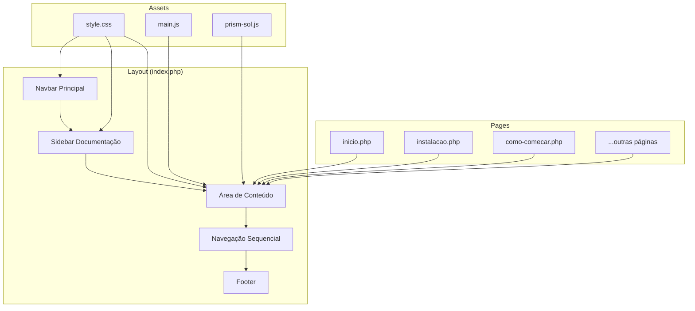

# Design Document

## Overview

Este documento descreve a arquitetura e implementação para padronização da documentação da linguagem Sol. O objetivo é criar uma experiência consistente, com syntax highlighting automático via Prism.js, navegação sequencial clara e estrutura de páginas uniforme.

## Architecture



## Components and Interfaces

### 1. Sistema de Navegação Sequencial

O layout incluirá um array PHP definindo a ordem das páginas para navegação:

```php
$page_order = [
    // Primeiros Passos
    'inicio',
    'instalacao', 
    'como-comecar',
    // Básico
    'variaveis',
    'tipo-numeros',
    'tipo-texto',
    'tipo-logicos',
    'condicionais',
    'repeticoes',
    // Intermediário
    'funcoes',
    'tipo-tabelas',
    'tabelas',
    'modulos',
    'controle-fluxo',
    // Paradigmas
    'paradigma-imperativo',
    'paradigma-procedural',
    'paradigma-oo',
    'paradigma-funcional',
    // Avançado
    'metamethods',
    'tratamento-erros',
    // Bibliotecas
    'lib-matematica',
    'lib-texto',
    'lib-tabela',
    'lib-utf8',
    // Sistema
    'lib-entrada-saida',
    'lib-sistema',
    'lib-package',
    // Concorrência
    'lib-corrotinas',
    'lib-assincrono',
    'lib-paralelismo',
    'canais',
    // Ferramentas
    'lib-teste',
    'lib-debug',
    'lib-nds',
    // Referência
    'referencia',
    'referencia-biblioteca'
];
```

### 2. Componente de Navegação Anterior/Próximo

Será adicionado ao final de cada página automaticamente pelo layout:

```php
function render_page_navigation($current_page, $page_order, $page_names) {
    $current_index = array_search($current_page, $page_order);
    $prev_page = $current_index > 0 ? $page_order[$current_index - 1] : null;
    $next_page = $current_index < count($page_order) - 1 ? $page_order[$current_index + 1] : null;
    // Renderiza botões de navegação
}
```

### 3. Estrutura Padrão de Página

Cada página seguirá este template:

```html
<div class="container py-5">
    <h1>📦 Título da Página</h1>
    <p class="lead">Descrição breve do conteúdo.</p>
    
    <h2>Seção Principal</h2>
    <p>Conteúdo...</p>
    
    <div class="code-block">
        <pre><code class="language-sol">-- código aqui</code></pre>
    </div>
    
    <div class="tip-box">Dica útil</div>
    <div class="warning-box">Aviso importante</div>
    <div class="success-box">Mensagem de sucesso</div>
</div>
```

### 4. Sistema de Syntax Highlighting

O Prism.js será configurado para processar automaticamente todos os blocos de código:

**Estrutura HTML padronizada:**
```html
<div class="code-block">
    <pre><code class="language-sol">código puro aqui</code></pre>
</div>
```

**Processamento automático (prism-sol.js):**
- Detecta todos os `<pre>` na página
- Envolve em `.code-block` se necessário
- Adiciona `<code class="language-sol">` se ausente
- Aplica highlighting via Prism
- Adiciona botão de copiar

### 5. Sidebar Reorganizada (Progressão Didática)

A sidebar será organizada em seções que seguem uma progressão natural de aprendizado:

```
📚 Documentação
├── 🚀 Primeiros Passos
│   ├── Instalação
│   └── Como Começar
├── 📝 Básico
│   ├── Variáveis
│   ├── Números
│   ├── Texto
│   ├── Lógicos
│   ├── Condicionais
│   └── Repetições
├── 🎯 Intermediário
│   ├── Funções
│   ├── Tabelas
│   ├── Módulos
│   └── Controle de Fluxo
├── 🎨 Paradigmas
│   ├── Imperativo
│   ├── Procedural
│   ├── Orientação a Objetos
│   └── Funcional
├── 🔧 Avançado
│   ├── Metamétodos
│   └── Tratamento de Erros
├── 📚 Bibliotecas
│   ├── Matemática
│   ├── Texto
│   ├── Tabela
│   └── UTF-8
├── 🌐 Sistema
│   ├── Terminal
│   ├── Sistema Operacional
│   └── Pacote
├── ⚡ Concorrência
│   ├── Corrotinas
│   ├── Filamento
│   ├── Paralelismo
│   └── Canais
├── 🛠️ Ferramentas
│   ├── Testes
│   ├── Depuração
│   └── NDS
└── 📖 Referência
    ├── Referência Rápida
    └── Biblioteca Padrão
```

## Data Models

### Mapa de Páginas

```php
$page_config = [
    'page_order' => [...],  // Ordem sequencial
    'page_names' => [       // Nomes amigáveis
        'inicio' => 'Início',
        'instalacao' => 'Instalação',
        // ...
    ],
    'page_sections' => [    // Agrupamento por seção
        'inicio' => 'Início',
        'fundamentos' => ['variaveis', 'condicionais', ...],
        'tipos' => ['tipo-numeros', 'tipo-texto', ...],
        // ...
    ]
];
```

## Correctness Properties

*A property is a characteristic or behavior that should hold true across all valid executions of a system-essentially, a formal statement about what the system should do. Properties serve as the bridge between human-readable specifications and machine-verifiable correctness guarantees.*

### Property 1: Ausência de Código Inline

*For any* página PHP em `pages/`, o arquivo não deve conter atributos `style=""` inline, tags `<style>`, nem tags `<script>` (exceto inclusões via src).

**Validates: Requirements 1.3, 5.1**

### Property 2: Estrutura de Code Blocks Padronizada

*For any* bloco de código em qualquer página, deve seguir a estrutura `<div class="code-block"><pre><code class="language-sol">...</code></pre></div>` e não deve conter spans manuais de highlighting (como `<span class="keyword">`).

**Validates: Requirements 2.2, 2.4, 5.2**

### Property 3: Estrutura de Página Consistente

*For any* página de documentação (exceto `inicio.php`), deve existir exatamente um elemento `<h1>` contendo emoji, seguido de um `<p class="lead">`, e usar apenas classes padronizadas (`.tip-box`, `.warning-box`, `.success-box`) para boxes informativos.

**Validates: Requirements 4.1, 4.2, 4.4**

### Property 4: Hierarquia de Headings Correta

*For any* página que contenha seções, os headings devem seguir hierarquia correta: H1 para título principal, H2 para seções, H3 para subseções, sem pular níveis.

**Validates: Requirements 4.3**

## Error Handling

### Página Não Encontrada
- Se uma página solicitada não existir em `$allowed_pages`, redirecionar para `404.php`
- Manter navegação funcional mesmo em páginas de erro

### Código Malformado
- O Prism.js deve processar código mesmo se mal formatado
- Fallback para texto puro se highlighting falhar

## Testing Strategy

### Testes Manuais
1. Verificar cada página para consistência visual
2. Testar navegação sequencial em todas as páginas
3. Verificar syntax highlighting em todos os code blocks
4. Testar responsividade em diferentes tamanhos de tela

### Checklist de Validação por Página
- [ ] Título H1 com emoji presente
- [ ] Parágrafo lead presente
- [ ] Code blocks usando estrutura padronizada
- [ ] Sem estilos inline
- [ ] Sem spans manuais de highlighting
- [ ] Botões de navegação funcionais
- [ ] Boxes (tip, warning, success) com classes corretas
